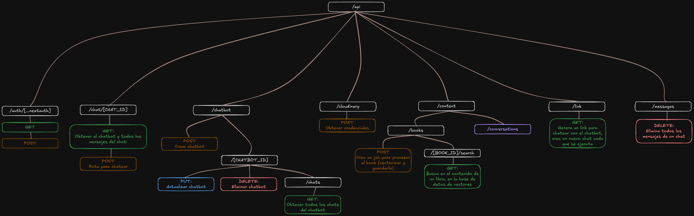

## Lista de rutas:

- /api/auth/[...nextauth]:
    - GET
    - POST
- /api/chat/[CHAT_ID]:
    - GET: Obtener el chatbot y todos los mensajes del chat:
    - POST: Ruta para chatear
- /api/chatbot:
    - POST: Crear chatbot
    - /[CHATBOT_ID]:
        - PUT: Actualizar chatbot
        - DELETE: Eliminar chatbot
        - /chats:
            - GET: Obtener todos los chats del chatbot
- /api/cloudinary:
    - POST: obtener las credenciales necesarias para usar cloudiary
- /api/content:
    - /books:
        - POST: Crea un job para procesar el book (vectorizar y guardarlo)
        - /[BOOK_ID]/search:
            - GET: Busca en el contenido de un libro, en la base de datos de vectores
    - /conversation: WIP
- /api/link/[CHATBOT_ID]:
    - GET: Genera un link para chatear con el chatbot, crea un nuevo chat cada que se ejecuta
- /api/messages/[CHAT_ID]:
    - DELETE: Elimina todos los mensajes de un chat

[Excalidraw Diagram:](https://excalidraw.com/#json=5OXdRieICH1KUTZtah8Xm,vmSK6Te4aJ28Q242ZoqUyw)

